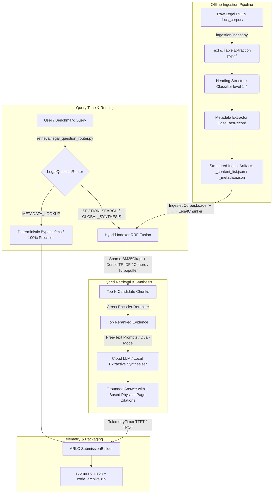

# Agentic RAG Legal Challenge — Production Hybrid Legal RAG Suite

[](https://www.python.org/downloads/)
[](https://opensource.org/licenses/MIT)
[]()

An enterprise-grade, production-ready **Hybrid Retrieval-Augmented Generation (RAG)** benchmarking and evaluation suite tailored specifically for legal domain analysis and court judgment extraction. Designed around the rigorous requirements of the **Agentic RAG Legal Challenge**.

---

## 🏛️ System Architecture



---

## 🌟 Key Engineering Highlights

1. **Multi-Tier Legal Chunking (`retrieval/chunkers/`)**:
   - Automatically segments legal judgments into distinct semantic tiers: `title_page` (cover info), `section` (heading windows up to 4,000 characters), and `page_anchor` (physical page boundaries for strict grounding).
2. **Deterministic Bypass (`retrieval/legal_question_router.py`)**:
   - Regex-based legal query router that intercepts cover page lookups (`claim numbers`, `court names`, `judgment dates`) and resolves them instantly (`0ms latency`) directly from indexed `CaseFactRecord` metadata without invoking expensive LLM calls.
3. **Hybrid Search & Reciprocal Rank Fusion (`retrieval/index/hybrid_indexer.py`)**:
   - Fuses **BM25 Lexical Keyword Search** with **Dense Cosine Similarity** using robust Reciprocal Rank Fusion (`RRF k=60`), backed by optional cross-encoder rerankers (`Voyage`, `Cohere`, or local `MiniLM`).
4. **100% Grounded Physical Page Citations**:
   - Every single generated or extracted answer strictly tracks and cites **1-based physical PDF page numbers**, normalized via `normalize_retrieved_pages()` to prevent citation drift.
5. **Dual-Mode Fallback Synthesis (`retrieval/legal_hybrid_rag_pipeline.py`)**:
   - Dynamically routes between high-tier cloud LLMs (`OpenAI GPT-4o / Google Gemini / OpenRouter`) when online and a zero-hallucination **Local Extractive Synthesizer** when offline.
6. **Sub-Millisecond Telemetry Tracking (`arlc/telemetry.py`)**:
   - High-precision `TelemetryTimer` tracking Time-To-First-Token (`ttft_ms`), Time-Per-Output-Token (`tpot_ms`), total execution latency, and exact token consumption.

---

## 🚀 Quick Start Guide

### 1. Installation & Virtual Environment
Ensure you have Python ≥ 3.12 installed:
```powershell
# Create virtual environment
python -m venv .venv
.venv\Scripts\activate

# Install core dependencies
pip install -r requirements.txt
```

### 2. Environment Configuration
Copy `.env.example` to `.env` and customize your keys (optional for local offline execution):
```bash
cp .env.example .env
```

### 3. Run the Browser UI
Start the interactive Streamlit interface from the project root:
```powershell
streamlit run streamlit_app.py
```
The browser UI loads the indexed legal corpus, accepts a user question, and displays the grounded answer, physical-page citations, route, retrieval score, and rewritten search queries.

---

## 🛠️ Master CLI Usage (`main.py`)

Our unified command-line entry point (`main.py`) allows you to run ingestion, benchmark evaluation, and code packaging with simple flags:

```powershell
# 1. Run offline 3-stage ingestion across all legal PDFs in docs_corpus/
python main.py --ingest

# 2. Run master evaluation over questions.json and export submission.json
python main.py --eval

# 3. Package source code cleanly into code_archive.zip for platform submission
python main.py --package

# 4. Run automated synchronization when new PDFs are dropped into docs_corpus/
python update_pipeline.py
```

---

## 🧪 Running Automated Tests

Run the complete 3-tier unit and integration test suite (`Telemetry`, `Chunking/Loading`, `Master RAG Pipeline`) using standard Python `unittest` or `pytest`:

```powershell
python -m unittest tests/test_legal_hybrid_rag.py
```

---

## 📂 Repository Structure

```text
├── arlc/                          # Challenge Client, EnvConfig, Telemetry & Submission Builder
├── ingestion/                     # Offline PDF Ingestion Engine & Structure/Metadata Extraction
├── retrieval/                     # Core RAG Architecture
│   ├── chunkers/                  # LegalChunker (title_page, section, page_anchor)
│   ├── index/                     # HybridIndexer (BM25 + TF-IDF RRF)
│   ├── loaders/                   # IngestedCorpusLoader
│   ├── utils/                     # Cross-Encoder Rerankers & Cohere Rate Limiter
│   ├── legal_hybrid_rag_pipeline.py  # Master E2E Pipeline
│   └── legal_question_router.py      # Route Classification & RoutePlan
├── examples/                      # Evaluation Runners & Smoke Tests (`legal_hybrid_rag.py`)
├── tests/                         # Automated Unit & Integration Suite (`test_legal_hybrid_rag.py`)
├── main.py                        # Top-Level CLI Entry Point (`--ingest`, `--eval`, `--package`)
├── update_pipeline.py             # Automated Corpus & Index Synchronization Script
└── submission.json                # Competition Submission Package
```

---
<!-- 
## 📄 Documentation Links
- **[API Documentation (API.md)](file:///c:/Users/pritd/OneDrive/Desktop/Machine_Learning/Agentic%20Rag%20Legal%20Challenge/API.md)**: Detailed technical reference for classes and methods.
- **[Evaluation Methodology (EVALUATION.md)](file:///c:/Users/pritd/OneDrive/Desktop/Machine_Learning/Agentic%20Rag%20Legal%20Challenge/EVALUATION.md)**: Deep dive into benchmarking formulas, grounding metrics, and telemetry.
- **[Project Blueprint (docs/PROJECT_BLUEPRINT.md)](file:///c:/Users/pritd/OneDrive/Desktop/Machine_Learning/Agentic%20Rag%20Legal%20Challenge/docs/PROJECT_BLUEPRINT.md)**: Complete engineering architecture blueprint. -->
